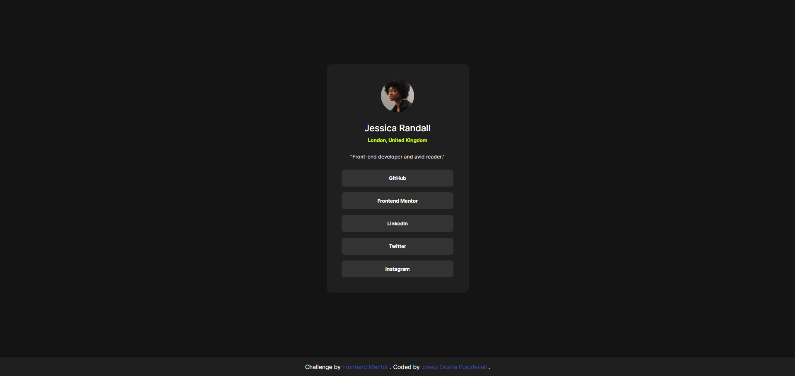
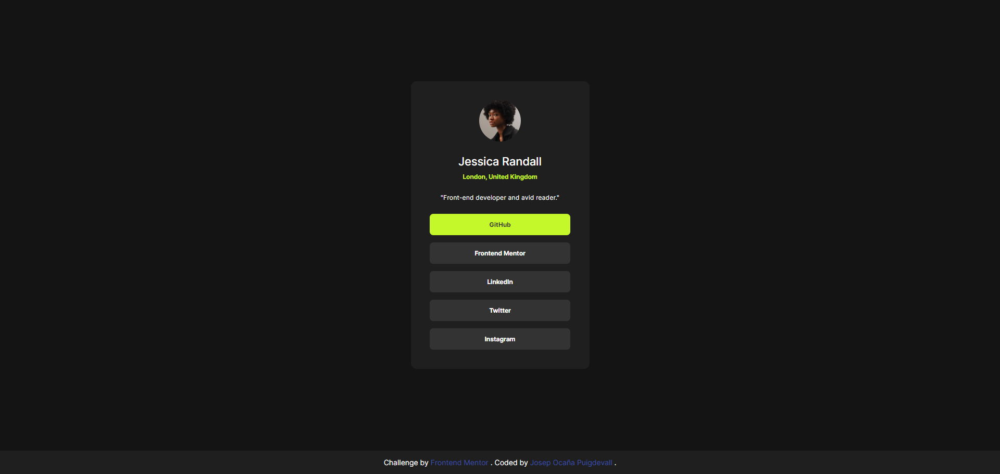
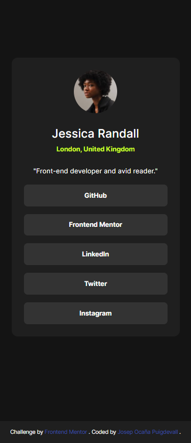

# Frontend Mentor - Social links profile solution

This is a solution to the [Social links profile challenge on Frontend Mentor](https://www.frontendmentor.io/challenges/social-links-profile-UG32l9m6dQ). Frontend Mentor challenges help you improve your coding skills by building realistic projects.

## Table of contents

- [Overview](#overview)
  - [The challenge](#the-challenge)
  - [Screenshot](#screenshot)
  - [Links](#links)
- [My process](#my-process)
  - [Built with](#built-with)
  - [What I learned](#what-i-learned)
  - [Continued development](#continued-development)
  - [Useful resources](#useful-resources)
- [Author](#author)
- [Acknowledgments](#acknowledgments)

## Overview

This is a Frontend Mentor project of a social profile.

### The challenge

We have to create html and css code to make the page as close as possible to the original one.

### Screenshots







### Links

- Solution URL: [@Pepekid_social-links-profile_project](https://github.com/Pepekid/frontendMentor-social-links-profile-main)
- Live Site URL: [Add live site URL here](https://glowing-duckanoo-0c80df.netlify.app/)

### Built with

- Semantic HTML5 markup
- CSS custom properties
- Flexbox

### What I learned

My workflow has been better than in the previous project.
I have also reinforced my workflow with git.

- I organized my navigation bar with useful classes

```html
<nav class="nav">
  <ul class="nav-list">
    <li class="nav-item">
      <a class="nav-link" href="#" aria-label="My profile in GitHub">GitHub</a>
    </li>
    <li class="nav-item">
      <a class="nav-link" href="#" aria-label="My profile in Frontend Mentor"
        >Frontend Mentor</a
      >
    </li>
  </ul>
</nav>
```

- I have learned to use flexbox in CSS (I have to go deeper in the subject) and to position the elements where I want using rem as unit measures.

```css
main {
  display: flex;
  flex-direction: column;
  justify-content: space-between;
  align-items: center;
  width: 24.7rem;
  height: 39.5rem;
  margin: 11.15rem auto 0 auto;
  border-radius: 0.8rem;
  background: var(--DarkGrey);
  padding: 2.6rem;
}
```

### Continued development

I would like to continue creating projects from scratch with html, css and javascript and I would like to learn react too.

### Useful resources

- [Creating Navigation Bar](https://www.w3schools.com/css/css_navbar.asp) - w3schools.com helps me so much when I want information about Css and html code and structure.

- [Flex-basis](https://developer.mozilla.org/es/docs/Web/CSS/flex-basis) - This is a page of MDN Web Docs where explains of what flex-basis do.

- [ChatGPT](https://chat.openai.com/) - This tool is very useful for any doubts or for resolve any problems tha I could have.

## Author

- Frontend Mentor - [@Pepekid](https://www.frontendmentor.io/profile/Pepekid)

## Acknowledgments

- I would like to thank frontend mentor for doing these exercises that help so many people to improve and refine their code for a better future.
- I would like to thank w3schools and MDN Web Docs for offering so much support to the people and the community of developers who are always helping by solving problems and teaching.

- I would also like to thank Miki for motivating me and for his support.

- I would also like to thank my family for their support and for let me **_"play"_** with the computer. `:)` Jejeje
